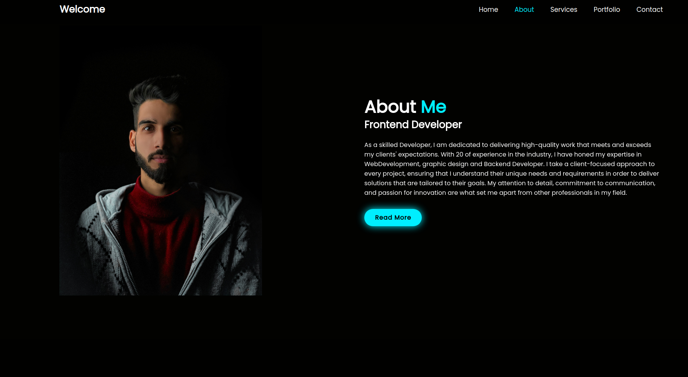

# Portfolio

## Preview 
https://portfolio-yamy.netlify.app/

---
## Description

This is an example of a creative portfolio where you can showcase your projects and link them to your social media accounts. The portfolio features cool fonts and a lot of animation, including various transitions, highlighting effects, and dynamic text. It was created using JS, HTML, CSS, and PWD. 

---
## Table of Contents

    A.[Installation](#installation)
    1. git clone  https://github.com/Yamy007/Portfolio
    2. cd Portfolio
    

    B.[Usage](#usage)
    1. Open the index.html change the links to your social media accounts and add your projects. change the images to your own images.

    2. Open the script.js file and change the text to your own text.

---

## Images

---

## Author Info

- GitHub - [Yamy007](https://github.com/Yamy007)
- Telegram - [Yamy](https://t.me/yamy19007)

---
## Credits

- [Poppins](https://fonts.google.com/specimen/Poppins)
  

